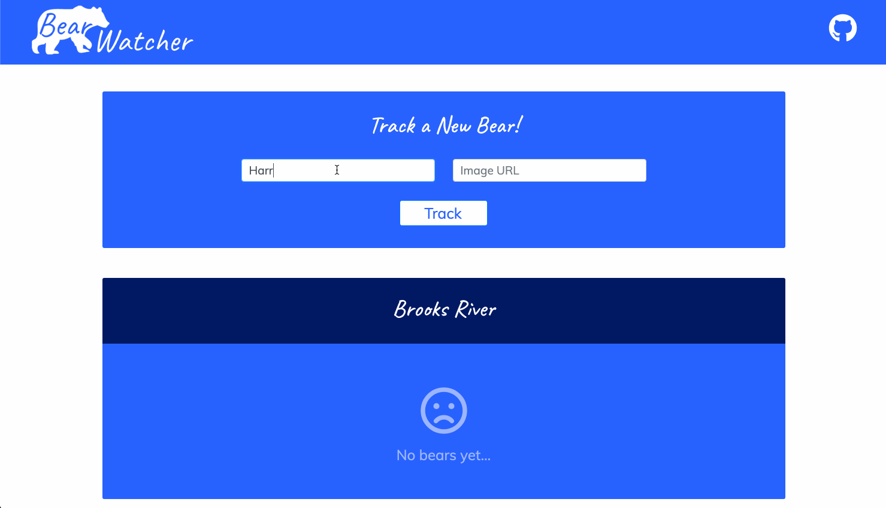
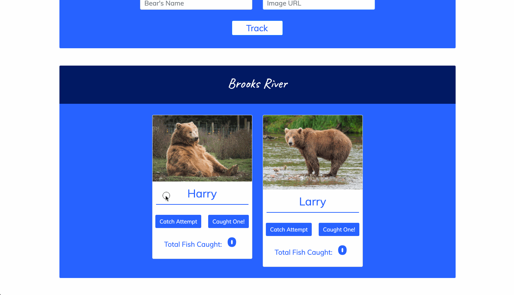

# Bear Watcher

This project is a basic form where you can add the name and image URL of a bear that will be added to a Brooks River section. Once a new bear is added, you can select if the bear attempted to catch a fish in the river, and then if they successfully caught the fish! There is a counter displaying the total number of fish caught as well as timestamps for each attempt and catch. The goal of this project was to experiment with JavaScript ES6 Modules. It gives the codebase better organization, making it very easy to find and fix or add content in the right place without having to search too far.

## Preview

Adding a new Bear:

---

Tracking Attempts and Fish Catches:

## View Project
- Clone the repository 👉🏼 `$ git clone https://github.com/RyanBeiden/bear-watcher.git`

- Run any http server `$ hs` or code editor to view project 👀

## Technologies Used
  

#### Backlog/Roadmap

- Build an awards section that displays the top 3 bears who have caught the most fish
